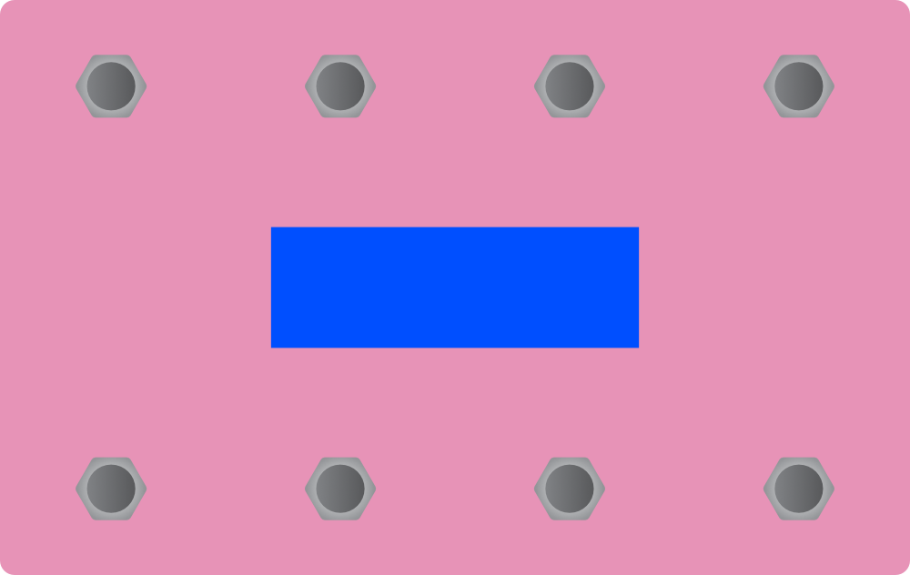

# MIDI Lord

### Libraries used

- `FlashStorage_STM32` by Khoi Hoang
- `Keypad` by Mark Stanley
- `ArduinoJson` by Benoit Blanchon
- `StreamUtils` by Benoit Blanchon
- `MIDI Library` by fortyseveneffects
- `MIDIUSB` by Gary Grewal
- `LiquidCrystal_I2C` by ejoyneering

### Parts

| Part | Type | Qty |
| --- | --- |:---:|
| Enclosure | 1590DD | 1 |
| Footswitches | SPST momentary | 8 |
| MIDI connector | Panel DIN | 2 |
| DC jack | 5.5x2.1mm | 1 |
| MCU | Black Pill STM32F401C | 1 |
| LCD | I2C | 1 |
| 6N138 | | 1 |
| USB C to panel cable | | 1 |